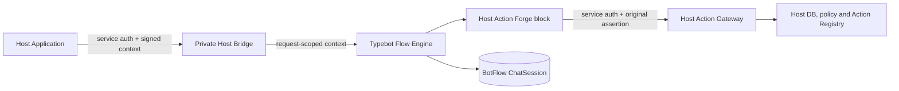

# Host Platform Integration

BotFlow Studio is a reusable Flow Engine. A Host Application owns identity, business data, permissions, and action implementations; BotFlow owns visual authoring, published flow data, and flow sessions.



## Contract

The private viewer routes are:

- `POST /api/internal/host/flows/verify` with `{ "flowId": "published-flow-id" }`. This service-authenticated endpoint confirms that an open, published, available Flow exists; it does not return Flow data.
- `POST /api/internal/host/start` with `{ "flowId": "published-flow-id", "message": "optional" }`
- `POST /api/internal/host/sessions/:sessionId/continue` with `{ "flowId": "published-flow-id", "message": "input" }`

Both require `x-host-service-key` and a signed `x-host-execution-context`. Continue also requires the opaque `x-host-session-binding` returned by start. The request body flow ID must match the signed context and the persisted session's published-flow reference.

The context envelope is versioned and HMAC-signed:

```json
{
  "version": 1,
  "iss": "host-id",
  "aud": "botflow-host-action",
  "flowId": "published-flow-id",
  "executionId": "request-id",
  "iat": 0,
  "exp": 0,
  "claims": { "host-specific": "opaque-to-BotFlow" }
}
```

BotFlow validates the signature, audience, issuer presence, flow ID, execution ID and time bounds. It does not inspect or authorize claim fields. The complete verified envelope and signed token live only in server-side `AsyncLocalStorage` for the request. Claims are used only as opaque input to the HMAC session binding. Nothing from the context is added to variables, prefill, block options, Flow JSON, `ChatSession.state`, results, or client responses.

`HOST_BRIDGE_SERVICE_KEY` authenticates Host → BotFlow. `HOST_EXECUTION_CONTEXT_SIGNING_KEY` verifies the Host assertion. `HOST_SESSION_BINDING_KEY` signs session bindings. Separately, `HOST_API_BASE_URL` and `HOST_SERVICE_AUTH_KEY` configure BotFlow → Host Action Gateway. These secrets are deployment configuration; they never belong in a Flow or Builder credential.

The `Host Action` Forge block takes an `actionKey`, key/value inputs, and an output variable. It posts to the configured Host's `/internal/host/actions/:actionKey` endpoint, passing the signed assertion and distinct Host service credential. It accepts only a controlled `{ "kind": "TEXT", "text": "..." }` result. Missing context, denial, timeout, malformed result, and transport errors fail closed with a generic error. Public chat and Builder preview have no trusted Host context.

## Ownership and persistence

The Host owns its user model, permissions, action registry and database. It reloads the actor and rechecks connection/app/policy on every action; a signed claim is an assertion and locator, not an authorization grant.

BotFlow owns draft and published graph data plus `ChatSession.state` in its own database. Start and continue reuse Typebot's existing handlers. The session snapshot retains the graph used at start; publishing a new graph does not rewrite a running session. On completion, Typebot removes the ChatSession and keeps the Result. The Host may keep a protected session reference for its own restart/correlation needs, but must not duplicate graph or session state.

The private path is not made private by its URL. Deploy it on an internal service network or remove it from public ingress/use a strict proxy allowlist, in addition to the separate service authentication and signed context.

## Connect another Host

Implement the same Host contract in the application:

1. Sign the envelope with the configured context key. Keep project-specific identity and permission values inside `claims`.
2. Provide a private Host Action Gateway at `/internal/host/actions/:actionKey` and authenticate the BotFlow service separately from the context signature.
3. Reload the actor and enforce permissions in the Host; allowlist action keys and validate each action's inputs there.
4. Return a controlled text result for the current supported subset.
5. Configure the deployment's Host API URL and distinct service credentials. No BotFlow code, Forge core, or engine traversal change is needed for a new Host.

There is no dynamic Action Catalog yet. The first live gateway example and published-session regression are documented in [the ShahrFarsh example](examples/shahrfarsh.md). This is a contract example, not a dependency of the Host bridge.

## Verification status

The Host bridge, Flow verification, request-scope isolation, generic block invocation, public fail-closed behavior, and synthetic Host Gateway contract have targeted tests. On 2026-09-29, the opt-in published-flow regression passed against a new local disposable PostgreSQL database after building the viewer: official migrations, actual publish, real `ChatSession`, Flow pause, process restart, same-session continue/completion, context/credential leak scan, session isolation, and public fail-closed checks. This test uses a synthetic Host gateway and identity; it is not production channel acceptance. Production routing remains planned.
