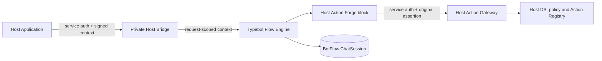
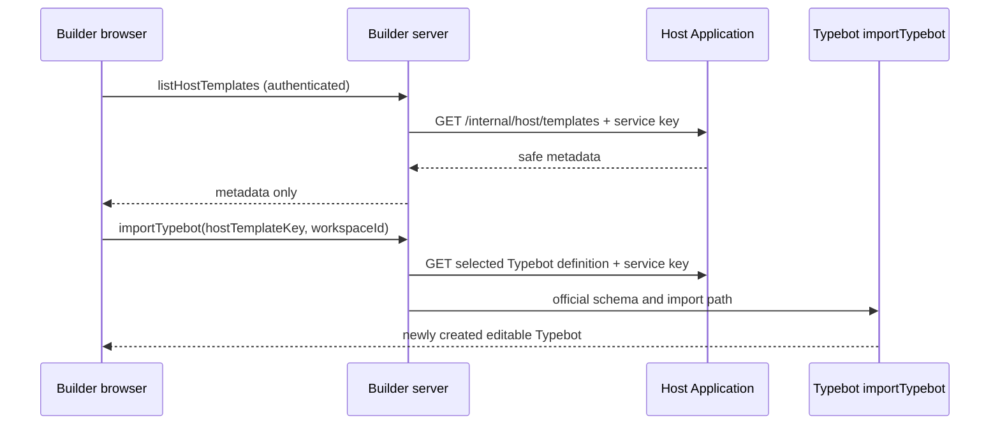

# Host Platform Integration

BotFlow Studio is a reusable Flow Engine. A Host Application owns identity, business data, permissions, and action implementations; BotFlow owns visual authoring, published flow data, and flow sessions.



## Contract

The private viewer routes are:

- `POST /api/internal/host/flows/verify` with `{ "flowId": "published-flow-id" }`. This service-authenticated endpoint confirms that an open, published, available Flow exists; it does not return Flow data.
- `POST /api/internal/host/flows/metadata` with `{ "flowId": "published-flow-id" }`. This service-authenticated management endpoint returns only publication status, display name, update time, the public ID and the related editable Typebot ID; it never returns graph/session data. Its status does not authorize runtime execution.
- `POST /api/internal/host/start` with `{ "flowId": "published-flow-id", "message": "optional" }`
- `POST /api/internal/host/sessions/:sessionId/continue` with `{ "flowId": "published-flow-id", "message": "input" }`

Both require `x-host-service-key` and a signed `x-host-execution-context`. Continue also requires the opaque `x-host-session-binding` returned by start. The request body flow ID must match the signed context and the persisted session's published-flow reference.

The context envelope is versioned and HMAC-signed:

```json
{
  "version": 1,
  "iss": "host-id",
  "aud": "botflow-host-action",
  "flowId": "published-flow-id",
  "executionId": "request-id",
  "iat": 0,
  "exp": 0,
  "claims": { "host-specific": "opaque-to-BotFlow" }
}
```

BotFlow validates the signature, audience, issuer presence, flow ID, execution ID and time bounds. It does not inspect or authorize claim fields. The complete verified envelope and signed token live only in server-side `AsyncLocalStorage` for the request. Claims are used only as opaque input to the HMAC session binding. Nothing from the context is added to variables, prefill, block options, Flow JSON, `ChatSession.state`, results, or client responses.

`HOST_BRIDGE_SERVICE_KEY` authenticates Host → BotFlow. `HOST_EXECUTION_CONTEXT_SIGNING_KEY` verifies the Host assertion. `HOST_SESSION_BINDING_KEY` signs session bindings. Separately, `HOST_API_BASE_URL` and `HOST_SERVICE_AUTH_KEY` configure BotFlow → Host Action Gateway. These secrets are deployment configuration; they never belong in a Flow or Builder credential.

The `Host Action` Forge block takes an `actionKey`, key/value inputs, and an output variable. It posts to the configured Host's `/internal/host/actions/:actionKey` endpoint, passing the signed assertion and distinct Host service credential. It accepts only a controlled `{ "kind": "TEXT", "text": "..." }` result. Missing context, denial, timeout, malformed result, and transport errors fail closed with a generic error. Public chat and Builder preview have no trusted Host context.

## Ownership and persistence

The Host owns its user model, permissions, action registry and database. It reloads the actor and rechecks connection/app/policy on every action; a signed claim is an assertion and locator, not an authorization grant.

BotFlow owns draft and published graph data plus `ChatSession.state` in its own database. Start and continue reuse Typebot's existing handlers. The session snapshot retains the graph used at start; publishing a new graph does not rewrite a running session. On completion, Typebot removes the ChatSession and keeps the Result. The Host may keep a protected session reference for its own restart/correlation needs, but must not duplicate graph or session state.

The private path is not made private by its URL. Deploy it on an internal service network or remove it from public ingress/use a strict proxy allowlist, in addition to the separate service authentication and signed context.

## Connect another Host

Implement the same Host contract in the application:

1. Sign the envelope with the configured context key. Keep project-specific identity and permission values inside `claims`.
2. Provide a private Host Action Gateway at `/internal/host/actions/:actionKey` and authenticate the BotFlow service separately from the context signature.
3. Reload the actor and enforce permissions in the Host; allowlist action keys and validate each action's inputs there.
4. Return a controlled text result for the current supported subset.
5. Configure the deployment's Host API URL and distinct service credentials. No BotFlow code, Forge core, or engine traversal change is needed for a new Host.

## Action Catalog

The Builder's generic Host Action selector fetches `GET /internal/host/actions/catalog` from the configured Host. The request is made by the Builder server using `HOST_API_BASE_URL` and `HOST_SERVICE_AUTH_KEY`; these values must exist only in server environment configuration. The selector receives metadata only:

```json
{
  "actions": [
    {
      "key": "system.whoami",
      "title": "Current Bot User",
      "description": "Returns a controlled summary of the admitted user and platform.",
      "inputs": [],
      "outputs": [{ "key": "text", "type": "string" }]
    }
  ]
}
```

Each input/output type is a primitive (`string`, `number`, or `boolean`); an input may also declare `required`. The searchable selector matches the displayed title, key and description, and shows schema hints. Flow values are mapped through the block's simple key/type/value rows. The Host owns and registers safe, displayable metadata beside its Action implementation; it must not include secrets or user-specific data. BotFlow stores no catalog rows. A Host can add Actions without a BotFlow source change.

Catalog data is only Builder metadata. It neither invokes an Action nor grants a user permission. Runtime continues to post the saved `actionKey` to `/internal/host/actions/:actionKey`; the Host reloads identity and applies its existing binding, policy and allowlist checks. A removed Action remains visible as an unavailable saved key when editing, and runtime continues to fail closed. Existing manually saved keys remain schema-compatible.

When the Catalog cannot be reached, the Builder remains usable, reports a local retry state, and does not expose service credentials. Published runtime execution does not call or depend on the Catalog endpoint. The fetch uses the existing short request timeout and no polling; Builder's query cache controls refresh.

The ShahrFarsh implementation is a Host example in [its integration evidence](examples/shahrfarsh.md), not a BotFlow dependency. Its registered `system.whoami` metadata is served by its authenticated Host endpoint.

## Host Template Catalog

Hosts may also own source-controlled Typebot starter definitions. The generic Host contract is:

- `GET /internal/host/templates` returns `{ "templates": [{ "key", "name", "description" }] }` for the existing Builder picker.
- `GET /internal/host/templates/:key` returns the selected metadata and a Typebot definition.

Both requests use the existing server-only `HOST_API_BASE_URL` and `HOST_SERVICE_AUTH_KEY` configuration and the `x-host-service-key` header. The Builder server exposes only catalog metadata to the browser. It fetches a definition only while creating a selected template; the definition is validated by Typebot's existing import schema and then passed through the normal `importTypebot` handler, workspace authorization, migrations, sanitizers and database create operation. Host Action references are checked against the Host Action Catalog when present. Invalid definitions or stale Action keys fail before Typebot creation.



Host catalog failure is isolated to the Host section; local built-in templates remain usable. The created Typebot is a copy with no runtime link to the source template. Later Host template edits affect only future creations, and no template catalog is stored in BotFlow's database. Runtime authorization remains in the Host Action Gateway; template visibility and embedded `actionKey` values grant no permission.

Another Host can add a template by implementing these two endpoints and returning a valid Typebot definition. It does not require BotFlow source changes, a database table, or custom Builder code. BotFlow does not own Host template content or business semantics.

## Adding a Host Template

1. Keep the definition and safe display metadata in the Host's source-controlled registry.
2. Return only registered action keys and normal Typebot blocks; never include service credentials, signed assertions, tokens or permission claims.
3. Validate the definition with the same Typebot version used by the deployed Builder and test the normal import path.
4. Treat the resulting Typebot as independent; no template provenance, update propagation, marketplace or BotApp auto-binding is provided.

## Verification status

The Host bridge, Flow verification, request-scope isolation, generic block invocation, public fail-closed behavior, synthetic Host Gateway contract, and metadata-only catalog fetch have targeted tests. On 2026-09-29, the opt-in published-flow regression passed against a new local disposable PostgreSQL database after building the viewer: official migrations, actual publish, real `ChatSession`, Flow pause, process restart, same-session continue/completion, context/credential leak scan, session isolation, and public fail-closed checks. This test uses a synthetic Host gateway and identity; it is not production channel acceptance. Production routing remains planned.

## Builder identity through Custom OAuth

Builder authentication uses the existing Typebot Custom OAuth OIDC provider, independently of Host Bridge service authentication. Configure `CUSTOM_OAUTH_ISSUER`, confidential `CUSTOM_OAUTH_CLIENT_ID`/`CUSTOM_OAUTH_CLIENT_SECRET`, scopes `openid profile email`, and profile paths matching the issuer (`sub`, `name`, `email` for standard claims). The callback is `${NEXTAUTH_URL}/api/auth/callback/custom-oauth`. Client secrets remain server-only.

The provider validates the OIDC ID Token, state and S256 PKCE and reads profile claims from the standard UserInfo endpoint (`idToken: false` in Auth.js). An issuer need not duplicate email/profile claims inside an authorization-code ID Token. A generic callback regression covers a signed subject-only ID Token, UserInfo mapping, PKCE and invalid state.

Workspace access still uses native Typebot membership. A native `MEMBER` invitation with the exact stable email claim is consumed by the existing auth adapter on first account creation; repeated login resolves the same `(provider, providerAccountId)`. Email is an invitation attribute, while the immutable OIDC subject is the identity. No Host DB access or alternate provisioning system is needed.

For management handoff to private editor routes, use official `/signin` with a trusted same-origin `callbackUrl` for OAuth and a safe root-relative `redirectPath` for an already authenticated browser. The destination can be `/typebots/{editableId}/edit` or `/typebots/create`; new Flow creation uses the currently selected native workspace. Authentication does not grant arbitrary workspace/Flow access. Issuer and Builder logout are separate; no distributed logout or iframe integration is implied.

## Embedded Studio publish notification

When the Builder is embedded, a successful publish emits `hostStudio.flowPublished` to the exact origin in `document.referrer`. The versioned message contains only the editable Typebot ID and its public Flow ID. Standalone publishing sends no Host message. The Host must validate `event.origin` and `event.source`, then verify the ID relationship and published status through its configured Host API before binding anything. The event is a notification only; it does not grant access or authorize an action. No wildcard target origin or Host-specific event is used.

## Adding a Host Action

Implement and register the Action in the Host, add its safe `title`, `description`, primitive input definitions and controlled output hints to the Action metadata, then expose the registered metadata through the authenticated catalog endpoint. The Builder selector discovers it automatically. Runtime still resolves the same stable `actionKey` through the Host Gateway; changing/removing a key requires deliberate Host-side compatibility handling. No BotFlow block, Forge core or engine change is needed for a new Host capability.
